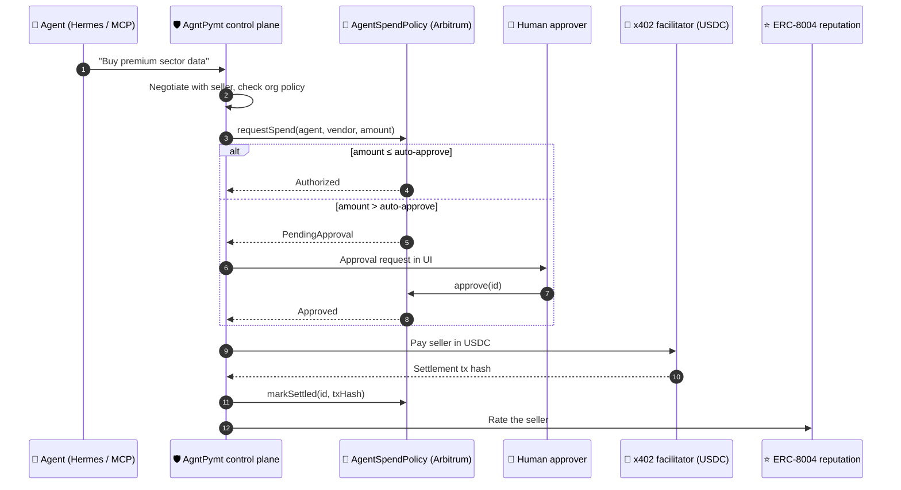

<div align="center">


<a href="https://github.com/SumitShinde0702/agntpymt-arbitrum">
  
</a>

<p>
  <a href="https://sepolia.arbiscan.io/address/0x542A4322762b255f8bA53F6A236B6191c8Cd0e1c"></a>
  <a href="https://explorer.testnet.chain.robinhood.com/address/0x7F67212561DcD231a9316a54A4A336F7059A4234#code"></a>
  <a href="https://repo.sourcify.dev/421614/0x542A4322762b255f8bA53F6A236B6191c8Cd0e1c"></a>
</p>

<p>
  
  
  
  
  
  
  
  
</p>

<p>
  <a href="#-the-problem">Problem</a> ·
  <a href="#-the-solution">Solution</a> ·
  <a href="#-how-it-works">How it works</a> ·
  <a href="#-deployed-contracts">Contracts</a> ·
  <a href="#-quick-start">Quick start</a> ·
  <a href="#-demo-flows">Demo</a>
</p>

</div>

---

## 🚨 The problem

AI agents can now buy API calls, data and SaaS, and pay invoices on their own. Telling an AI *"don't spend more than $10"* is a suggestion, not a control: models hallucinate, get prompt-injected, and misread instructions. When an agent holds a funded wallet, one bad output becomes a real payment you can't undo.

No bank, fintech or supply chain will hand an LLM a funded wallet without the controls it applies to employees: **spending limits, approvals, a kill switch and an audit trail**. So today enterprises either block agent payments entirely, or hard-code a private key and hope for the best.

> Most agent-payment work targets consumers: one agent buying for one person. **AgntPymt is built for the enterprise:** fleets of agents spending company money, under rules a regulator can audit.

## 🛡️ The solution

AgntPymt is a **governance layer that wraps around the AI**. The agent decides what it wants to buy. AgntPymt decides whether it's allowed. Every spend is authorized, approved and recorded by an **on-chain policy contract on Arbitrum**, and settled in USDC over [x402](https://x402.org).

<table>
  <tr>
    <td width="50%" valign="top">
      <h3>🪪 Agent identity</h3>
      Every agent gets its own wallet, bound on-chain with an <b>EIP-712 consent signature</b>. Every dollar is tied to a named agent, not a shared key.
    </td>
    <td width="50%" valign="top">
      <h3>📜 Rules the AI can't talk around</h3>
      <code>AgentSpendPolicy</code> enforces per-tx caps, daily caps, auto-approve thresholds and kill switches. Not the agent, not the prompt, not even our server can bypass it.
    </td>
  </tr>
  <tr>
    <td width="50%" valign="top">
      <h3>🙋 Human-in-the-loop</h3>
      Small spends settle instantly. Anything above the threshold waits for a human to <code>approve()</code> on-chain, and expires after 3 days.
    </td>
    <td width="50%" valign="top">
      <h3>🧾 Regulator-grade audit</h3>
      x402 USDC settlement is recorded against the on-chain request, and every seller is rated on the <b>ERC-8004</b> reputation registry.
    </td>
  </tr>
</table>

### ⚡ Why Arbitrum

- **Cheap enough to govern every call.** Agent commerce means thousands of $0.01 payments. A policy check, an approval and a settlement record cost cents on Arbitrum, so governance doesn't eat the margin.
- **Settlement and governance on one chain.** x402 USDC (`eip155:421614`), ERC-8004 identity and reputation, and `AgentSpendPolicy` all live on Arbitrum Sepolia. The whole audit trail is one Arbiscan query.
- **Robinhood Chain.** The same contract runs on Robinhood Chain testnet, an Arbitrum chain, so agents can be governed wherever tokenized assets live.

## 🔄 How it works



### 📜 `AgentSpendPolicy.sol` ([`contracts/`](contracts/))

| Feature | How |
| --- | --- |
| 🪪 **Agent binding** | Org admin binds an agent wallet with an **EIP-712 consent signature from the agent**, so nobody can claim someone else's agent address |
| 📏 **Limits** | Per-tx cap, rolling-day cap, auto-approve threshold (invariant: `auto ≤ perTx ≤ daily`) |
| 🙋 **Human-in-the-loop** | Spends above the threshold are `PendingApproval` until the admin calls `approve()`; they expire after 3 days |
| 🛑 **Kill switches** | Per-agent `setAgentActive(false)` and org-wide `setOrgFrozen(true)`; both also block settlement of already-authorized spends |
| 🔑 **Operators** | Admin can delegate request/settle to a backend (AgntPymt), so agents need no gas |
| 💸 **Settlement** | `markSettled(id, x402TxHash)` for off-contract x402 payments, or `execute(id)` to pull USDC agent → vendor via `transferFrom` |
| 🔒 **Safety** | OpenZeppelin `SafeERC20`, `ReentrancyGuard`, `SignatureChecker` (EOA + ERC-1271), custom errors, checks-effects-interactions |

## 🌐 Deployed contracts

| Network | AgentSpendPolicy | Token | Source verified |
| --- | --- | --- | --- |
| **Arbitrum Sepolia** (421614) | [`0x542A4322762b255f8bA53F6A236B6191c8Cd0e1c`](https://sepolia.arbiscan.io/address/0x542A4322762b255f8bA53F6A236B6191c8Cd0e1c) | USDC `0x75faf114eafb1BDbe2F0316DF893fd58CE46AA4d` | ✅ [Sourcify exact match](https://repo.sourcify.dev/421614/0x542A4322762b255f8bA53F6A236B6191c8Cd0e1c) |
| **Robinhood Chain testnet** (46630) | [`0x7F67212561DcD231a9316a54A4A336F7059A4234`](https://explorer.testnet.chain.robinhood.com/address/0x7F67212561DcD231a9316a54A4A336F7059A4234#code) | MockUSDC [`0x542A…0e1c`](https://explorer.testnet.chain.robinhood.com/address/0x542A4322762b255f8bA53F6A236B6191c8Cd0e1c#code) | ✅ Blockscout |

ERC-8004 registries (Arbitrum Sepolia): Identity `0x8004A818BFB912233c491871b3d84c89A494BD9e`, Reputation `0x8004B663056A597Dffe9eCcC1965A193B7388713`.

Deployment records: [`contracts/deployments/`](contracts/deployments/).

<details>
<summary><b>🧪 Contracts: test and deploy</b></summary>

```bash
cd contracts
npm install
npm test                          # 16 tests: binding, limits, approvals, kill switches, settlement
npm run deploy:arbitrum-sepolia   # needs DEPLOYER_PRIVATE_KEY with Arbitrum Sepolia ETH
npm run deploy:robinhood-testnet
npm run export-abi                # refresh server/src/chain/spend-policy-abi.ts
```

Server integration smoke test against any RPC (local Hardhat node or Arbitrum Sepolia):

```bash
SPEND_POLICY_ADDRESS=0x... SPEND_POLICY_ADMIN_PRIVATE_KEY=0x... npx tsx server/scripts/smoke-spend-policy.ts
```

</details>

## 🚀 Quick start

```bash
# 1. Copy env (single root .env for client + server)
cp .env.example .env

# 2. Install dependencies
npm install

# 3. Start PostgreSQL (Docker)
npm run db:up

# 4. Build db package, migrate & seed
npm run build -w db
npm run db:migrate
npm run db:seed

# 5. Start dev (client :5173 + server :3001)
npm run dev
```

Open [http://localhost:5173](http://localhost:5173). The landing page is at [`/home`](http://localhost:5173/home).

All variables live in **one root `.env`** file. Vite reads `VITE_*` keys via `envDir: '..'` in `client/vite.config.ts`, and the server loads the same file from the repo root.

## 🎬 Demo flows

Micro-payments default to **$0.01 USDC** (`DEMO_TRANSACTION_FEE_USD` in `.env`). Re-seed after pricing changes: `npm run db:seed`.

| # | Flow | Agent | What happens |
| --- | --- | --- | --- |
| 1 | ✅ **Auto-approve + negotiate** | Research Agent | "Buy premium sector research data": seller quotes $0.02, agent counters $0.01, settles instantly |
| 2 | ⚡ **Instant micro-pay** | Procurement Agent | "Order office supplies": $0.01, under the limit, no approval needed |
| 3 | 🙋 **Human approval** | Cloud Ops Agent | "Pay AWS invoice": negotiates to $0.08, exceeds the $0.05 auto-approve limit, approve in UI |

<details>
<summary><b>🤖 Optional: Hermes background runtime</b></summary>

AgntPymt provisions one **Hermes profile per agent** under `~/.hermes/profiles/{orgId}__{agentId}/` with `SOUL.md`, `config.yaml` (including the `agntpymt` MCP server), and `skills/`. Manage identity and capabilities from **Agents → Identity / Capabilities** in the UI.

### Local setup

```bash
pip install hermes-agent
hermes setup
# Enable API in ~/.hermes/.env:
#   API_SERVER_ENABLED=true
npm run dev:all   # client + server + hermes gateway (:8642)
```

On Windows, Hermes 0.17.0 can crash with `ModuleNotFoundError: cron.scheduler_provider` (package name collision). `dev:all` uses `scripts/hermes-gateway.py` to work around this automatically.

If the gateway starts but AgntPymt still shows Hermes offline, confirm `API_SERVER_ENABLED=true` in `~/.hermes/.env` and restart `npm run dev:all`.

When the Hermes gateway is online, **Run** in the Agent Console delegates to Hermes with the agent's SOUL as `instructions` and streams lifecycle events into the chat feed. Purchases go through the `agntpymt` MCP tool (`AGENT_ID` is set per profile in `config.yaml`).

### Single-gateway limitation

One `hermes gateway` process uses **one** `HERMES_HOME` at startup. All agent profile **files** are created on disk, but skills/MCP from inactive profiles are not loaded until that profile is the gateway's home. For local MVP:

- SOUL is passed via `instructions` on each `/v1/runs` call (works across profiles).
- The shared `agntpymt` MCP entry uses per-profile `AGENT_ID` in env when Hermes loads that profile's `config.yaml`.

For full per-agent runtime isolation later: one gateway per org, subprocess per run with `HERMES_HOME=profile_path`, or Hermes per-run profile APIs.

See `docs/hermes-mcp.example.json` for a manual MCP reference (AgntPymt auto-writes this into each agent profile).

</details>

## 🗺️ Roadmap

- [x] On-chain `AgentSpendPolicy` with 16 Hardhat tests
- [x] Deployed and verified on Arbitrum Sepolia and Robinhood Chain testnet
- [x] x402 USDC settlement and ERC-8004 reputation on Arbitrum
- [ ] Arbitrum One mainnet deploy, with a Safe multisig as policy admin
- [ ] On-chain vendor allowlists
- [ ] Stylus port of the policy hot path for cheaper checks
- [ ] SDK so any agent framework can call `requestSpend` via MCP

---

<div align="center">

**Your agents are moving fast. Your controls should too.**

Built for the Arbitrum Open House Singapore Buildathon.

</div>
